 

## `// STACK`

<!--  -->

 

## `// PROJECTS`

<table>
<tr>
<td width="50%" valign="top">

### [`42_Cursus`](https://github.com/AlexisParder/42_Cursus)
Core 42 curriculum projects — low-level C, systems programming.

</td>
<td width="50%" valign="top">

### [`Maneyge`](https://github.com/AlexisParder/Maneyge)
Full-stack PHP app — finances, shared calendar, todo system.

</td>
</tr>
</table>

> **`LessHumanity`** *(in dev)* — a post-apocalyptic survival game built in Unreal Engine 5. Work in progress, not yet public.

 

## `// TELEMETRY`

 
